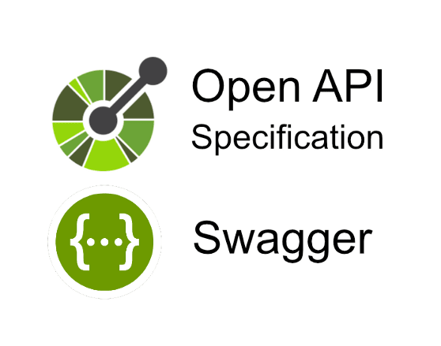
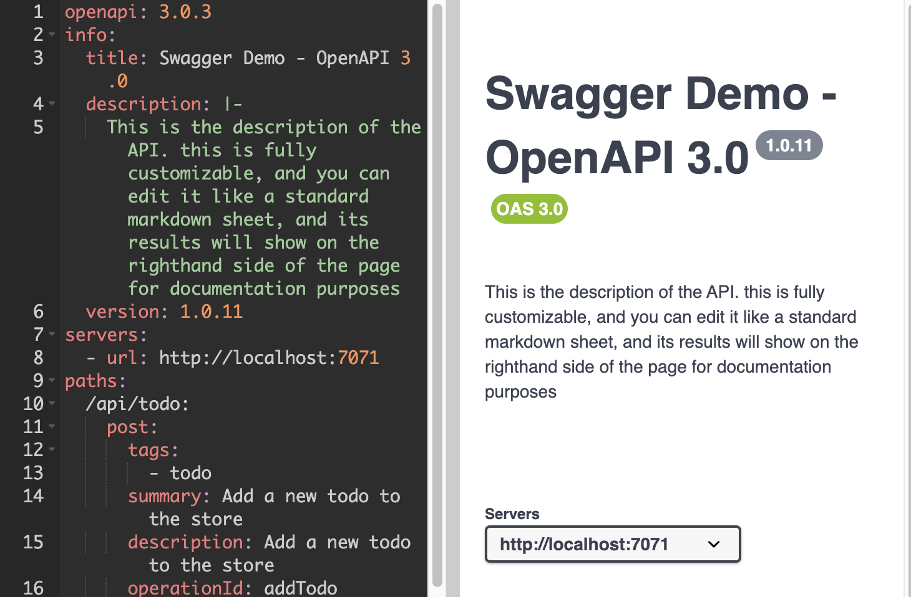

# Tech Demo of OpenAPI Specification and Swagger Editor



## Introduction

Welcome to the Penguin's tech demo! Today we will be introducing you to the OpenAPI Specification (OAS) and the Swagger Editor tool. In this tech demo, we will guide you through the process of setting up and using OAS and Swagger, configuring code generation, and utilizing a testing toolkit to create robust API backends for your websites. Get ready to dive into the world of API documentation and development!

## Why Use OpenAPI

The OpenAPI Specification (OAS) offers developers and teams a streamlined framework for structuring and documenting HTTP-based APIs. By adhering to this specification, all stakeholders in product development gain a cohesive and standardized method for API documentation. Moreover, OAS supports the generation of client code, the sending of requests, and the creation of test cases. Tools like the Swagger Editor leverage OAS to provide syntax error feedback, visualize APIs, facilitate HTTP requests, and more.

## OpenAPI Demonstration
The following is a demonstration of OpenAPI to understand the main concepts and provide a practical example of how this could be used in a real project.

### Task 1: Introduction to Swagger Editor

Let's start our journey with the [Swagger Editor](https://editor.swagger.io), a powerful tool by [SmartBear Software](https://smartbear.com/company/about-us/) for designing OpenAPI schemas.

Key Features:
- **Syntax Highlighting**: Enhances readability and reduces the chance of errors.
- **IDE-like Editing**: Provides a familiar environment for developers, boosting productivity.
- **Clean User Interface**: Allows for efficient navigation and operation.

The Swagger Editor supports both `yaml` and `json` file types. For larger projects, consider using the full desktop client.

### Task 2: Setting Up Your Swagger Editor

If you're new to Swagger, you'll initially see a default OpenAPI example. For more insights on their demo, please refer to the provided page.

To utilize our example, follow these steps:

1. Clone our repository:
    ```bash
    git clone https://github.com/csci5117s24/the-penguins-Open-API/
    ```
2. Import `schema.yaml` into the Swagger Editor. You can do this by either copying and pasting the file content or using the import function in the editor.

Upon successful import, your Swagger Editor should resemble the following:


The right-hand side of the editor displays an editable version of the OpenAPI schema. The left-hand side contains a visual representation of the schema, that is, the API endpoints and their associated request objects.   

### Task 3: Understanding Key Components of Our OpenAPI Document

Our OpenAPI document is composed of three primary elements: Servers, Paths, and Schemas. Let's delve into each one:

#### Servers
This section defines the base URL for your API. In our case, we're using `localhost:7071`. This means that our API is running locally on our machine, specifically on port 7071. All the paths defined in the `paths` section of the OpenAPI document will be appended to this base URL when making requests. This setup can be expanded in the future to include additional servers, such as those for staging or production environments.
    

#### Paths
Paths define the endpoints of your API. Each path corresponds to a specific request URL. Under each path, you specify the HTTP methods (GET, POST, PUT, DELETE, etc.) that the endpoint supports. For each method, you define the request parameters, body, and responses.

Here's the `/todo` endpoint from our example:

```yaml
paths:
  /api/todo:
    post:
      tags:
        - todo
      summary: Add a new todo to the store
      description: Add a new todo to the store
      operationId: addTodo
      requestBody:
        description: Create a new todo
        content:
          application/json:
            schema:
              $ref: '#/components/schemas/todo'
        required: true
      responses:
        '200':
          description: Successful operation
          content:
            application/json:
              schema:
                $ref: '#/components/schemas/todo'
        '400':
          description: Invalid input
        '422':
          description: Validation exception

```

#### Schemas
Schemas define the structure of the data that your API sends and receives. They are used in request bodies and responses to validate the data and ensure it matches the expected format.

Here's the todo schema from our example:

```yaml
components:
  schemas:
    todo:
      type: object
      properties:
        id:
          type: integer
          format: int64
          example: 10
        description:
          type: string
          example: "Do Something"
        done:
          type: boolean
          example: false
```

Once you've defined your servers, paths, and schemas, you can finally start using the Swagger UI tools to visualize your API and interact with it directly from your browser.

Note: To start sending requests, continue until step 5


### Task 3: Creating a React app to work with your Open API

To start using this API schema, we must create a react app that will act as our front end for the API. The nice thing about the Swagger is that you can use most application types, and for our purposes, it can be generated in typescript or javascript.

```bash
npx create-react-app demo-app --template redux-typescript
cd demo-app
```


### Task 4: Create code for your Azure backend HTTP requests.

Unfortunately, there are no working code-generation resources for creating Azure Http requests, but many other backend API services support OpenAPI autogeneration.
We have provided a sample backend in the demo Git repository.

Make sure to change your local.settings.json file to contain your personal connection string if using MongoDB
```json
{
    "Values": {
        "AZURE_MONGO_DB":"<INSERT MONGO_DB CONNECTION STRING HERE>",
        "FUNCTIONS_WORKER_RUNTIME": "node"
    },
    "IsEncrypted": false
}
```

We will use mongoose to provide database interactivity for our `Todo` items . If you would like to learn more about Mongoose as a utility for MongoDB, please visit their [website](https://mongoosejs.com/docs/index.html).
We then configure our code to comply with the schema and OpenApi requests we previously defined.

```javascript
const { app } = require('@azure/functions');
const { ObjectId } = require('mongodb');
const mongoClient = require("mongodb").MongoClient;
const mongoose = require('mongoose');
const Schema = mongoose.Schema;

const todoSchema = new Schema({
    description: { type: String, required: true },
    done: { type: Boolean, default: false },
    id: { type: Number, required: true }
});


app.http('newTodo', {
    methods: ['POST'],
    authLevel: 'anonymous',
    route: 'todo',
    handler: async (request, context) => {
        await mongoose.connect(process.env.AZURE_MONGO_DB);
        const body = await request.json();
        //const auth_header = request.headers.get('X-MS-CLIENT-PRINCIPAL');
        const Todo = mongoose.model('Todo', todoSchema);
        const name = body.description ?? "Todo 1"
        const id = body.id ?? 1
        const done = body.done;
        const newTodo = new Todo();
        newTodo.description = name; 
        newTodo.id = id;
        newTodo.done = done;
        const savedTask = await newTodo.save(); //save the new Todo task
        return{
            status: 201, /* Defaults to 200 */
            jsonBody: savedTask
        };
    },
});
```

Make sure to run ```npm i``` in both your main project folder and the api backend folder to install the correct dependencies.

In your main project folder, you can now run
```bash
npm run web
```
to start your frontend and backend servers.

### Task 5: Test out your API!

With your API set up and configured, you can now test these endpoints using the Swagger Editor. 
Go back to the page that you created your schema. On the right-hand side, you should see your specified endpoints and requests. Make sure to specify the correct server in the dropdown. 


For azure we use by default http://localhost:7071


Once you're ready to execute, click the "Execute" button. your response will then show up below near the expected server responses.


### Next Steps

Now that you have your openAPI specification set up and communicating with your server, you can now use the OpenAPI ecosystem that has a lot of support and useful tools such as:
1. Postman Integration
2. Code generation for a variety of tech stacks
3. Documentation helpers

### Feature 1: integrate with Postman

OpenAPI lets you integrate with Postman to send requests and collaborate with others on API development. First, you must export your OpenAPI YAML file from swagger editor. Select File > Save as YAML.
In Postman's online or desktop client, create a workspace. Once in your workspace, you can drag and drop your YAML file into your workspace. Click import.


You can now use your API definition to send requests from Postman.


Postman also has many other OpenAPI features such as viewing and editing documentation, generating schemas, and much more.

### Feature 2: Generate Open API models in react

There are many libraries that can be used to generate fetch code for a variety of different tech stacks. For react, we found this [OpenApi Typescript Generator](https://openapi-generator.tech/docs/generators/typescript/) to work pretty well with some modifications.

first go to your root project directory and install the generator with

```bash
npm i -D openapi-typescript typescript
```

Then with our openapi schema in our project's root directory, we ran

```bash
mkdir ./src/api
npx openapi-generator-cli generate -i openapi.yaml -g typescript -o ./src/api
```

This generated all the request code from our OpenAPI schema, and it even generates auth middleware and other useful tools that you can easily implement.

To use the generated code, we must first remove the unnecessary imports that aren't being used in ```path ./src/api/index.ts```. You can remove the following lines of code:
```typescript
export { Configuration } from "./configuration"
export { PromiseMiddleware as Middleware } from './middleware';
```

Modify the import structure of ./src/models/ObjectSerializer.ts :
```typescript
import { Todo } from '../models/Todo';
export * from '../models/Todo';
```

Once that is complete, you can now use your generated API definitions!
An example of this in action for our post request:

```typescript
import './App.css';
import * as TodoApi from './api/index'
import { Todo } from './api/index';
import * as fs from 'fs';

const configuration = TodoApi.createConfiguration();
const apiInstance = new TodoApi.TodoApi(configuration);

let body:Todo = {
  id: 10,
  description: "Do Nothing",
  done: false,
};

export default function App() {
  function postTodo() {
    apiInstance.addTodo(body).then((data:any) => {
      console.log('API called successfully. Returned data: ' + data);
    }).catch((error:any) => console.error(error));
  }

  return (
    <div className="App">
      <button onClick={postTodo}>Post</button>
    </div>
  );
}
```
### Feature 3: Documentation Generation

One of the key advantages of OpenAPI is its rich support for detailed documentation that could be especially useful in designing software with a waterfall approach if one needs to comply with regulations, or if there are other parties involved. To generate open API documentation, in your swagger editor, click "Generate Client" on the top bar and then select "HTML" from the dropdown. 


The resulting html serves as detailed documentation for your designed API.


## Other Features and Abilities with OpenAPI

There are so many other programs and tools that can be used with OpenAPI, a detailed list can be found here: https://openapi.tools/

## Review and Discussion

To conclude, OpenAPI is not just a helpful one-off visualizer for website APIs, but an entire ecosystem for full-stack API development. Now that you are equipped with the knowledge of how to develop and test an API within this ecosystem, you're on your way to become a more efficient and equipped web API developer. If you've made it this far then you probably can submit your feedback! Hope you enjoyed!
